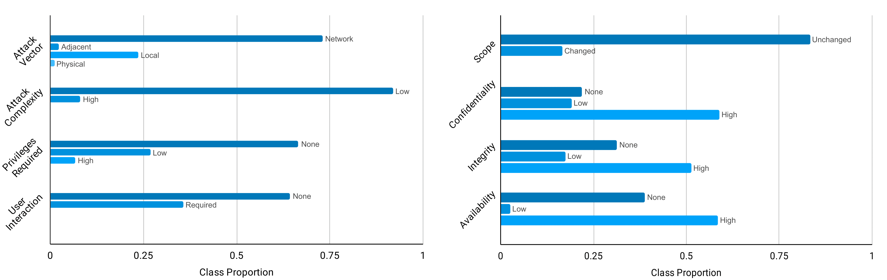

# CVSS Metric Calculator

## Do not forget to download transformers GitHub and install

---

## Dependencies

**Prerequisite: Python 3.8.6**

    scipy==1.6.3
    numpy==1.20.2
    pandas==1.2.4
    nltk==3.6.2
    matplotlib==3.4.2
    tqdm==4.49.0
    transformers==4.6.0.dev0
    torch==1.4.0
    nlp==0.4.0
    activations==0.1.0
    brokenaxes==0.4.2
    easydict==1.9
    file_utils==0.0.1
    scikit_learn==0.24.2
    utils==1.0.1
    xgboost==1.4.2

To ease the installation of dependencies we suggest using the `requirements.txt`, via pip:
```
$ pip install -r requirements.txt
```

Optionally, you can create a Python virtual environment and install all the dependencies in it:
```
$ python3 -m venv venv
$ source venv/bin/activate
```

---

## Dataset

The vulnerability dataset is obtained from the [National Vulnerability Database (NVD)](https://nvd.nist.gov/), a United States government repository of standards-based vulnerability management data. We obtain the information through their Application Programming Interface (API), starting from index 0 to 152,000, representing data collected until April 2021. We filter the data to only consider descriptions related to **version 3 of CVSS**. We divide them into train and test sets, composed of 63,848 and 15,962 instances, respectively, found in the `data` folder.
 
We process the collected data to retrieve vulnerability descriptions and the classes for each of the eight categories analyzed: *Attack Vector*, *Attack Complexity*, *Privileges Required*, *User Interaction*, *Scope*, *Confidentiality*, *Integrity*, and *Availability*. A visual representation of class proportions, for each category, of the dataset is displayed in the following figure:



---

## Experiments

We compare the performance of [BERT](https://arxiv.org/pdf/1810.04805.pdf), [RoBERTa](https://arxiv.org/pdf/1907.11692.pdf), [ALBERT](https://arxiv.org/pdf/1909.11942.pdf), [BART](https://arxiv.org/pdf/1910.13461.pdf), [DeBERTa](https://arxiv.org/pdf/1810.04805.pdf), and [DistilBERT](https://arxiv.org/pdf/1910.01108.pdf) models in the created dataset. In the following table we display the hyperparameters for finetuning, which was based on the authors' methodology for each model. All pretrained models are obtained from the [HuggingFace repository](https://huggingface.co/transformers/v2.9.1/pretrained_models.html).

| Model      | Learning Rate      | Training Epochs | Batch Size | Weight Decay |
|------------|--------------------|-----------------|------------|--------------|
| BERT       | 3e-05              | 3               | 4          | 0            |
| RoBERTa    | 1.5e-05            | 2               | 4          | 0.01         |
| ALBERT     | 3e-05              | 3               | 8          | 0            |
| BART       | 3e-05              | 3               | 4          | 0            |
| DeBERTa    | 3e-05              | 10              | 4          | 0            |
| DistilBERT | 5e-05              | 3               | 8          | 0            |


The models' accuracy for each of the eight categories analyzed are shown in the following table:

| Categories          | BERT | RoBERTa | ALBERT | BART | DeBERTa | DistilBERT |
|---------------------|------|---------|--------|------|---------|------------|
| Attack Vector       |      |         |        |      |         |            |
| Attack Complexity   |      |         |        |      |         |            |
| Privileges Required |      |         |        |      |         |            |
| User Interaction    |      |         |        |      |         |            |
| Scope               |      |         |        |      |         |            |
| Confidentiality     |      |         |        |      |         |            |
| Integrity           |      |         |        |      |         |            |
| Availability        |      |         |        |      |         |            |

---

## Citing Paper
If our work or code helped you in your research, please use the following BibTeX entries.

```BibTeX

```
